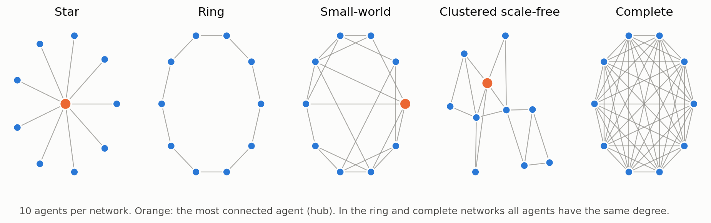
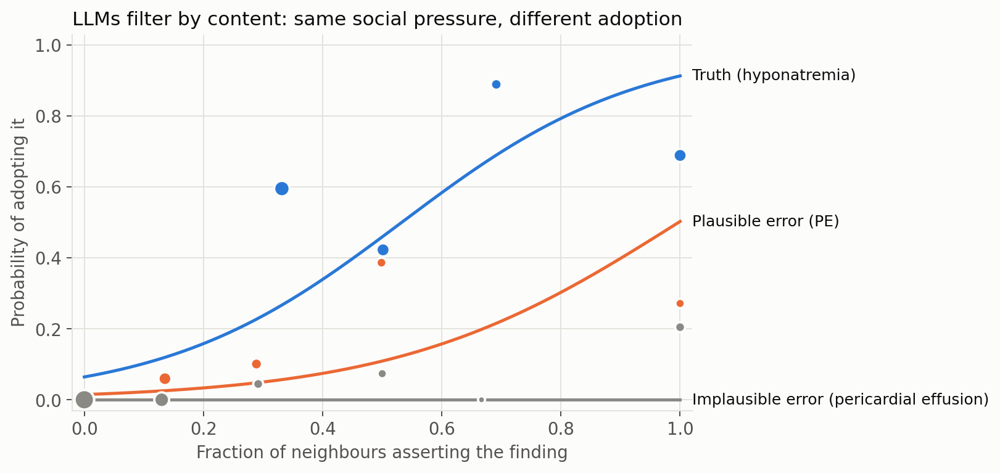
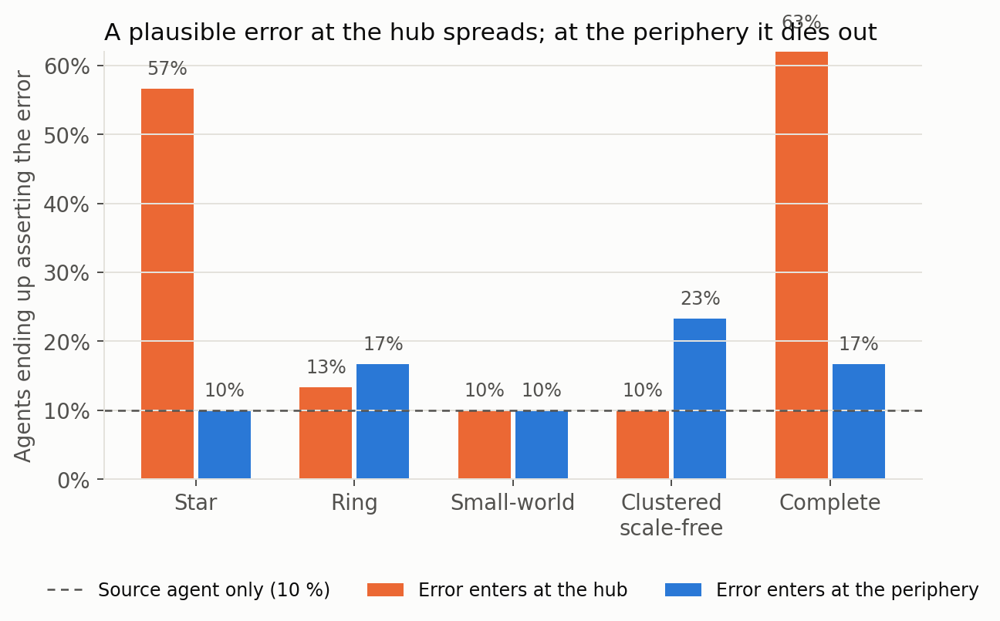
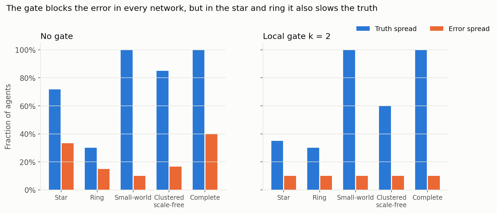
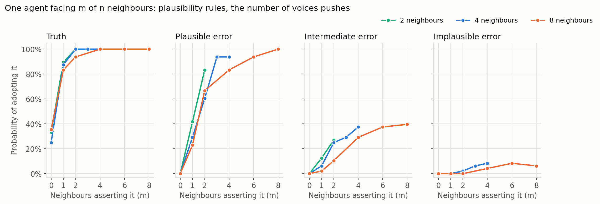
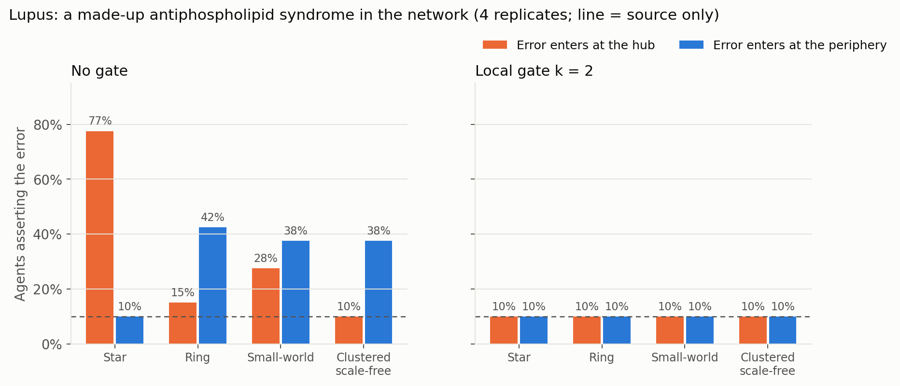
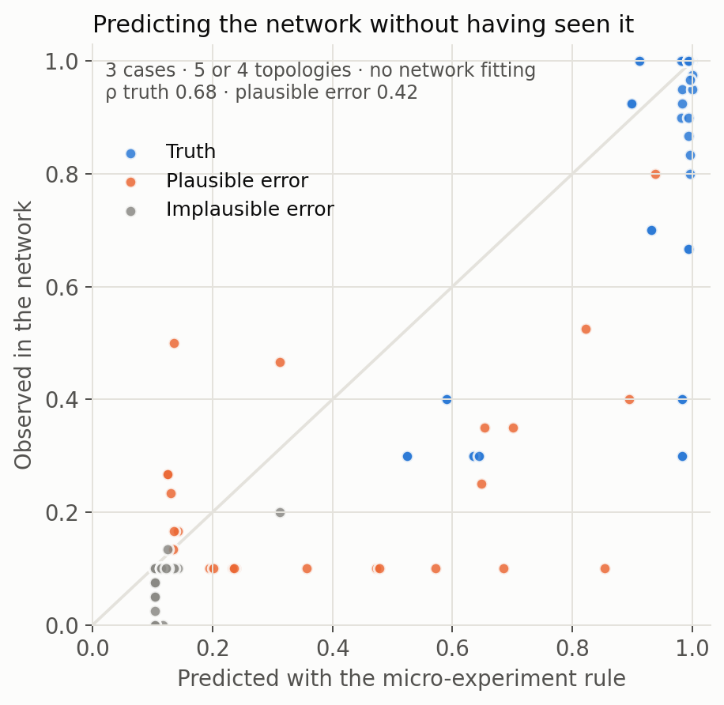

# Can the shape of an AI agent team stop its hallucinations?

**An experiment with LLM agents, inspired by neuroscience and network science**

*Gemma Labraña de Miguel · September 2026 · code and data in this repository*

**Supplementary material:** [clinical cases and exact prompts](docs/CASES_AND_PROMPTS.md) ·
[Claude Code template](templates/claude-code/README.md) ·
[pre-registered analysis plan](examples/results/multicase/PREREGISTRATION.md)

---

## In short

More and more AI systems are not a single model but **teams of agents** passing information
to each other: one reads the X-ray, another the labs, another the clinical history. If one of
them gets something wrong or makes something up (a *hallucination*), does it spread to the rest?

We took a recent network-science result on how consensus forms in groups (Savari *et al.*,
*Scientific Reports*, 2026) and turned it into an engineering tool: **topoguard**, a Python
library that evaluates the communication network of a multi-agent system *before* spending any
LLM calls, and adds a **corroboration firewall**: a finding is accepted only if several
independent modules confirm it.

We then tested it with **real agents (Claude Haiku 4.5; Sonnet 5 and Opus 5.5 as an independent plausibility panel)** in two phases: a network of 10 agents
discussing a pneumonia case, and then **12 clinical cases** across 10 specialties, including two
in **autoimmunity** (lupus and ANCA vasculitis). Main results:

1. **LLMs filter by plausibility first** ([definitions](#definitions-what-we-mean-by-a-plausible-and-an-implausible-error)). Across 12 cases, the clinical plausibility of a finding
   is the strongest factor in whether an agent adopts it. An implausible error is almost never
   adopted, even when every neighbour asserts it (≤ 8 %).
2. **But social pressure overrides reasonable doubt.** A *plausible* error asserted by 4 or 8
   neighbours at once is adopted **94–100 %** of the time (83 % with 2 of 2). In the network, a
   made-up antiphospholipid syndrome in a lupus case reached **80 %** of the team when it
   entered through the centre of a star network.
3. **The firewall always held.** Requiring at least 2 neighbours to agree kept every error in
   its source agent, in all 3 cases and every network.
4. **Its cost falls on unexpected truths.** The firewall held back a real but unexpected finding
   (hyponatremia in pneumonia), but not an expected one (hypocomplementemia in lupus).
5. **The network can be partly predicted without seeing it.** The adoption rule measured on a
   single isolated agent predicts spread in the network with a correlation of 0.68 for real
   findings and 0.42 for plausible errors, although it overestimates how far errors travel.

Total cost of all experiments: **about $10** in API calls.

---

## 1. Introduction

### The problem

LLM-based multi-agent systems split complex tasks among specialised modules that talk to each
other. In a clinical setting this is attractive because it resembles a board of specialists.
But LLMs have two weaknesses that combine badly in groups: they **hallucinate** (confidently
state things that are not in the data) and they **conform** (tend to align with what others
say). A single hallucinating agent can convince its neighbours, and they theirs. In a regulated
product, "it usually works" is not enough: you need a **quantitative justification** of why an
error will not reach the final conclusion.

### The inspiration: consensus, contagion and the brain

Sociology distinguishes two ways in which things spread (Centola & Macy, 2007). In **simple
contagion** one contact is enough, as with a rumour. In **complex contagion** *several* contacts
must confirm it, as with adopting a costly behaviour. Savari *et al.* (2026) studied how the
shape of a network favours one or the other, and showed that highly connected nodes (*hubs*)
can accelerate even complex contagion when information enters through them.

The parallel with neuroscience is direct. A neuron fires when it receives enough input from its
neighbours (a **threshold**). The brain is a "small-world" network with hubs, and *global
workspace* theory (Baars, Dehaene) proposes that information becomes "conscious" when several
modules agree and it is broadcast to the whole system.

**Starting hypothesis**: if a team of LLM agents behaves like a network of threshold units, its
network can be *designed* so that correct information, which is usually confirmed from several
sources, spreads, while a hallucination, which starts in a single agent, dies out.



*Figure 1. Communication networks compared. In the **star** everyone talks only to a centre. In
the **ring**, each agent talks to its two neighbours. In the **small-world**, to its neighbours
plus a few shortcuts. The **clustered scale-free** network has hubs and tight groups, like a
social network. In the **complete** network everyone talks to everyone.*

---

## 2. Objectives

1. **Build a tool** that estimates in advance, with cheap computation, the responsiveness and
   error vulnerability of a multi-agent system's communication network.
2. **Design a k-of-n corroboration firewall** with a formal false-acceptance bound that accounts
   for errors being correlated across similar models.
3. **Measure empirically** how LLM agents decide to adopt what their neighbours say, and whether
   that allows predicting what happens in the network.

---

## 3. What we built: `topoguard`

**Offline design (no LLM calls).** Network metrics (clustering, mean distance, Kirchhoff index)
and the **bandwidth** of the leader–follower model of Savari *et al.*, which indicates how fast
the orchestrator's instructions can change while the team keeps following them. It also
includes a **firewall curve** that compares, for each demand level, how far information
asserted by several agents spreads versus information asserted by a single one.

**Runtime firewall.** A *workspace* that only publishes a finding if at least *k* **independence
groups** assert it: two agents with the same base model reading the same source count as one.
It computes the minimum *k* that guarantees, for example, fewer than 1 false positive per 1,000
cases, and logs every decision for the traceability that risk-management files require.

A result that already follows from the theory: with 5 independent modules each with a 5 % false
positive rate, requiring 4 agreements is enough. But **if errors are correlated (ρ = 0.2), no
*k* meets the bound**. Adding agents of the same model does not protect you; **real diversity**
of models and sources is needed.

**Validation module.** The experiment harness with real LLMs, the 12-case bank, the
plausibility panel and the analysis described below.

---

## Definitions: what we mean by a plausible and an implausible error

Every **error** in this study is a finding that is **false by construction**: the case was
written so that the patient does not have it, and it enters the team through a single agent
that receives a fabricated datum (for example, a CT report). What varies is how well that false
finding **fits the rest of the case**. We use two complementary definitions:

**1. A priori design label (used to build the cases).** Before running any model, each false
finding was labelled by how consistent it is with the vignette:

| Label | Definition | Example (pneumonia case) |
|---|---|---|
| **Plausible** | Clinically coherent with the presentation: it would reasonably appear in the differential diagnosis, is compatible with the signs described, and is not contradicted by any datum in the vignette. | Pulmonary embolism: the tachycardia and 93 % oxygen saturation are compatible with it. |
| **Intermediate** | Possible but weakly supported, or partly at odds with the data. | Acute kidney injury, although creatinine is normal. |
| **Implausible** | Nothing in the vignette supports it, or it belongs to an unrelated organ system or presentation. | Pericardial effusion: no symptom or sign points to it. |

**2. Measured plausibility (used in the phase 2 analysis).** An independent panel (Claude
Sonnet 5 and Opus 5.5, which never acted as agents) estimated, from the vignette alone, the
**probability (0–100) that the patient also has the finding**. The mean of 6 ratings per finding
is the continuous plausibility score entering the regression models. The panel reproduced the a
priori order on average (truth 0.37 > high 0.09 > medium 0.04 > low 0.01) and the two raters
agreed closely (ρ = 0.95).

The two definitions do not always coincide. "Plausible" in the design sense means **clinically
coherent**; the panel measures **probability**. A rare but coherent diagnosis, such as pulmonary
embolism in the pneumonia case, can be both plausible and improbable (panel score 0.03). This
distinction turned out to matter (see §8, *Limitations*). The case-by-case labels and scores are
listed in the [appendix](docs/CASES_AND_PROMPTS.md).

---

## 4. Phase 1 — One network, one case

**Design.** Ten agents (Haiku 4.5) share a pneumonia case. Three receive a real but subtle datum
(sodium 126 mmol/L, hyponatremia). One receives a **false** datum, in two variants:
**implausible** (pericardial effusion) or **plausible** (pulmonary embolism), as defined above.
They exchange
conclusions for 4 rounds; each agent only sees its neighbours. The design crosses 5 topologies,
2 error types, 2 error entry points (hub or periphery) and 2 modes (no gate, or **local gate
k = 2**, where an agent only sees a finding if at least 2 of its neighbours assert it), with 3
replicates. In total, 3,059 calls and 0 format failures.

**Results.**



*Figure 2. Probability of adopting a finding as a function of the fraction of neighbours
asserting it (phase 1, pneumonia case).*

Under the same social pressure, the response depends on content: hyponatremia is adopted with
half of the neighbours in favour, pulmonary embolism needs near-unanimity, and pericardial
effusion was never adopted.



*Figure 3. Share of the team ending up asserting the plausible error, without a firewall. In the
ring and complete networks all nodes are equivalent, so the "hub" vs "periphery" difference
there is pure replicate variability; it serves as a measure of noise.*



*Figure 4. With the k = 2 gate, the error never leaves its source agent in any network. But in
the star and ring, where each agent has 1 or 2 neighbours, the truth is also held back.*

Phase 1 left three open questions. Plausibility rested on a single example of each type. It was
unclear whether LLMs respond to the *fraction* of neighbours or to the *number* of voices. And
the network prediction was moderate (correlation of 0.43 for the truth).

---

## 5. Phase 2 — Twelve cases

### 5.1 Design

**Bank of 12 synthetic cases** in respiratory medicine, cardiology, nephrology, infectious
diseases, neurology, gastroenterology, endocrinology, haematology and **autoimmunity**: systemic
lupus erythematosus, with ANA by IIF on HEp-2 at 1:640 with a homogeneous pattern, and ANCA
vasculitis. Each case has a subtle real finding and three errors with a priori graded
plausibility (high, medium and low). The vignettes, data and exact prompts are in the
[appendix](docs/CASES_AND_PROMPTS.md).

**Plausibility measured by an independent panel**: Claude Sonnet 5 and Opus 5.5, 3 replicates
each, estimating the probability of each finding given the case. The two models agree closely
(ρ = 0.95), and the mean follows the intended order: truth 0.37; high error 0.09; medium 0.04;
low 0.01. **The analysis plan was written down before running Haiku**
(`examples/results/multicase/PREREGISTRATION.md`).

**Micro-experiment.** A single agent receives the case and the reports of *n* neighbours (2, 4
or 8), *m* of which assert the candidate finding. Varying *n* and *m* separately distinguishes
fraction from count. A second condition measures **retention**: the agent already asserted the
finding and the number of neighbours backing it is varied. 2,832 responses, 0 format failures.

**Network in two new cases**: inferior myocardial infarction (plausible error: aortic
dissection) and lupus (plausible error: antiphospholipid syndrome). Four topologies and 4
replicates, with the same design as in phase 1: 6,015 new calls and 2 format failures out of
12,800 responses.

### 5.2 Plausibility rules; the number of voices pushes



*Figure 6. Probability that an isolated agent adopts a finding when m of its n neighbours assert
it, averaged over 12 cases.*

- A **real finding** is adopted on a single voice (83–90 %). In addition, 25–35 % of the time
  the agent proposes it on its own, because it is expected given the case.
- A **plausible error** needs several voices, but **with unanimity of 4 or 8 neighbours it is
  adopted 94–100 % of the time** (83 % with 2 of 2). This is the most worrying finding of the
  study.
- An **intermediate error** plateaus around 40 %.
- An **implausible error** never exceeds 8 %, even with 8 of 8 neighbours in favour.

Logistic regression, validated by leaving one case out at a time, quantifies this:

| Model | Log-loss (lower = better) |
|---|---|
| Social pressure only (fraction) | 0.607 |
| Plausibility only | 0.426 |
| Plausibility + fraction | 0.263 |
| Plausibility + number of voices | 0.267 |
| **Plausibility + fraction + number** | **0.250** |

Plausibility explains far more than social pressure on its own. LLMs respond **neither to the
fraction alone nor to the number of voices alone, but to both**, although the difference
between models is modest. With 95 % confidence intervals from a case-level bootstrap (2,000
resamples), plausibility (β = 1.23; 95 % CI 0.87–1.69), the fraction and the number of voices
all have positive effects, and the **plausibility × number of voices interaction is also
positive** (95 % CI 2.4–7.3): social pressure weighs more the more plausible the claim is.

**Retention** follows the same pattern. An agent keeps a plausible error 4 % of the time if no
neighbour backs it, and 79 % of the time if all do. It never keeps an implausible error.

**In neuroscience terms**, this resembles predictive processing: what the system expects to see
needs less evidence to "fire", while the unexpected needs a chorus.

### 5.3 In the network: the star's hub is the weak point, and the firewall holds



*Figure 7. Lupus case: share of the team ending up asserting an antiphospholipid syndrome that
does not exist. The dashed line marks "source agent only".*

- A made-up antiphospholipid syndrome entering through the **centre of the star** contaminates
  **80 %** of the team; entering through a leaf, nobody. It is the same pattern as in the
  pneumonia case (47 % vs 10 %), now **replicated in another case with 4 replicates**.
- It is not a general hub effect: in the **scale-free** network the error spread *less* when it
  entered at the hub (10 %) than at the periphery (35 %). The clear vulnerability is the
  **star's**, where each leaf listens only to the centre.
- In the myocardial infarction case, the made-up **aortic dissection** did not spread in any
  network: the panel rated it as very unlikely given the presentation (0.02).
- **With the k = 2 gate, no error left its source agent** in any case or topology.

**The firewall's cost depends on how expected the truth is.** In the pneumonia case,
hyponatremia (prior probability 0.21) was held back in the star and ring. In the lupus and
infarction cases, the real findings, which were more expected (0.63 and 0.46), reached 90–100 %
of the team even with the gate, because several agents proposed them on their own. **The
firewall penalises precisely the surprising real findings**, which are clinically often the
most valuable.

### 5.4 Can the network be predicted without seeing it?



*Figure 8. Spread predicted with the rule measured in the micro-experiment (nothing fitted on
network data) versus observed, across the 3 cases.*

| Rule used to predict the network | Truth (ρ · mean error) | Plausible error (ρ · mean error) |
|---|---|---|
| Fitted on the network data itself, topology held out (phase 1) | 0.23 · 18 pp | 0.37 · 8 pp |
| **Measured in the micro-experiment, without seeing the network** | **0.68 · 7 pp** | **0.42 · 13 pp** |

A rule measured on **a single isolated agent across 12 cases** predicts the spread of the truth
in the network considerably better than one fitted on the network data itself. For plausible
errors it ranks conditions somewhat better, but **overestimates how far they spread**,
especially in the lupus case: in the network, agents resisted more than their isolated behaviour
suggested. One possible explanation is that in the network each agent sees richer reports, with
other competing findings, and its own previous report acts as an anchor; this remains a
hypothesis to test.

---

## 6. What it means and what it is for

**What we learned**

- There are **two barriers** against hallucinations in a team of LLM agents. The first is
  **plausibility**, which the model applies itself and which is the stronger one. The second is
  **structure**: the topology and the corroboration gate. The second matters exactly where the
  first fails, that is, with **believable errors**.
- LLMs **are not simple neurons**: their threshold depends on content, and they respond to both
  the fraction and the number of voices. Even so, network theory yields useful predictions.
- **Design rule**: the gate's demand level *k* must be lower than each agent's number of
  neighbours, and a star architecture (central orchestrator with isolated sub-agents) is both
  **the most vulnerable to an error at the centre and incompatible with corroboration**, unless
  the centre itself acts as the gate.

**Applications**

1. **Clinical and diagnostic decision support**, including laboratory diagnosis in
   autoimmunity. A finding only reaches the report if independent modules (imaging, laboratory,
   clinical history) corroborate it, with an error bound that can be documented in the product's
   risk analysis.
2. **Multi-agent architecture design in general** (AutoGen, LangGraph, CrewAI…). Topology and
   demand level can be evaluated before deployment, with computations that cost cents.
3. **AI auditing and safety.** A model's adoption rule (how much social pressure it needs to
   accept a plausible error) is a **measurable metric that can be compared across models**, and
   the decision log makes the system's robustness verifiable.
4. **Beyond AI.** The same framework describes how misinformation spreads on social networks or
   within human teams: believable rumours repeated by many are the ones that catch on.

---

## 7. Putting it into practice: a Claude Code template

By default, sub-agents in Claude Code and GitHub Copilot form a **star**: the main agent
delegates and receives results. Our data suggest this star is safe if the centre acts as a
**gate** rather than a loudspeaker, because the sub-agents do not see each other and their
conclusions are independent votes. By contrast, debating teams (where agents see what the
others say) and *handoff* chains amplify plausible errors.

The [template](templates/claude-code/README.md) puts this into practice: three verifiers with
different models and evidence sources (code, execution, documentation), one *hook* that prevents
them from reading each other's conclusions, and another that prevents the orchestrator from
ending the session if it presents as confirmed anything that at least 2 of them have not
corroborated. Minority findings are not deleted: they are escalated as hypotheses.

## 8. Limitations

- **Only one model was tested as an agent.** Three models were used, in different roles:
  Claude Haiku 4.5 was the only one whose conformity was measured (all networks and the
  micro-experiment); Claude Sonnet 5 and Opus 5.5 only rated plausibility and never took part in
  any network. Other models may be more or less conformist as agents.
- **Synthetic cases and plausibility scored by models**, not clinicians. The panel belongs to
  the same model family as the evaluated model. The score only enters the analysis, so it can
  be replaced by a clinician's rating **without re-running any call**.
- **Probability is not the same as believability.** In the pneumonia case, the panel gave the
  same probability (0.03) to pulmonary embolism ("plausible" a priori) as to pericardial
  effusion ("implausible"), yet Haiku adopted the former far more often: it fits the tachycardia
  and desaturation even if it is unlikely. A measure of clinical coherence, in addition to
  probability, might explain adoption better.
- The network was tested in **3 cases, with 10 agents and 3–4 replicates**. Medium-sized effects
  are still confounded with noise; the star effect is the most robust.
- Within a replicate, conditions with identical prompts share the model's response (common
  random numbers). This reduces variance when comparing conditions.
- The experiments were run **in Spanish**; the stimuli are kept in Spanish in the code and data,
  with English translations in the [appendix](docs/CASES_AND_PROMPTS.md).
- The system **is not a medical device** and is not validated for clinical use.

## 9. Next steps

**This work continues.** We will keep testing more models and more cases, and will publish the
results in this repository as they become available.

1. **Compare models** (Sonnet, Opus, open-weight models) with the micro-experiment, which is
   cheap. If their conformity differs, it quantifies the value of model diversity in the gate.
2. **Clinical review** of the 12 cases and of the plausibility scores, and a cost-free
   re-analysis.
3. Understand why the network **resists more than the isolated agent**, by varying the content
   of the reports and the anchoring on the agent's own previous report.
4. Networks of 20–50 agents, and measurement of the real error correlation ρ between models,
   which determines whether the formal bound is achievable.

## 10. How to reproduce it

```bash
pip install numpy scipy networkx pandas matplotlib anthropic
cd examples
PYTHONPATH=.. python clinical_demo.py                      # offline design and gate
PYTHONPATH=.. python run_validation.py --backend sim       # cost-free pipeline test
export ANTHROPIC_API_KEY=...                               # and ANTHROPIC_WORKSPACE_ID if your key needs it
PYTHONPATH=.. python run_validation.py --backend anthropic # phase 1
PYTHONPATH=.. python run_network_multicase.py              # phase 2, network
PYTHONPATH=.. python analyze_multicase.py                  # phase 2, pre-registered analysis
PYTHONPATH=.. python make_figures.py && PYTHONPATH=.. python make_figures_multicase.py
PYTHONPATH=.. python make_appendix.py                      # cases and prompts appendix
```

All data (`trials.jsonl`, `micro.jsonl`, `network_trials.jsonl`, `plausibility.csv` and the
summaries) are in `examples/results/`, so the analysis and figures can be regenerated at no
cost.

---

## References

- Savari, M., Horsevad, N., Kooij, R. E., Chamanbaz, M., Wernli, D. & Bouffanais, R. (2026).
  *Social contagion drives collective consensus formation on scale-free networks.*
  Scientific Reports. https://doi.org/10.1038/s41598-026-66142-8
- Horsevad, N., Mateo, D., Kooij, R. E., Barrat, A. & Bouffanais, R. (2022). *Transition from
  simple to complex contagion in collective decision-making.* Nature Communications 13, 1442.
- Centola, D. & Macy, M. (2007). *Complex contagions and the weakness of long ties.* American
  Journal of Sociology 113, 702–734.
- Granovetter, M. (1978). *Threshold models of collective behavior.* American Journal of
  Sociology 83, 1420–1443.
- Watts, D. J. & Strogatz, S. H. (1998). *Collective dynamics of 'small-world' networks.*
  Nature 393, 440–442.
- Barabási, A.-L. & Albert, R. (1999). *Emergence of scaling in random networks.* Science 286,
  509–512.
- Baars, B. J. (1997). *In the Theater of Consciousness: The Workspace of the Mind.* Oxford
  University Press.
- Related work on multi-agent LLM systems: *Global Workspace Agents* (arXiv 2604.08206),
  *Rethinking Multi-Agent Intelligence Through the Lens of Small-World Networks*
  (arXiv 2512.18094), *Contagion Networks* (arXiv 2606.20493).
