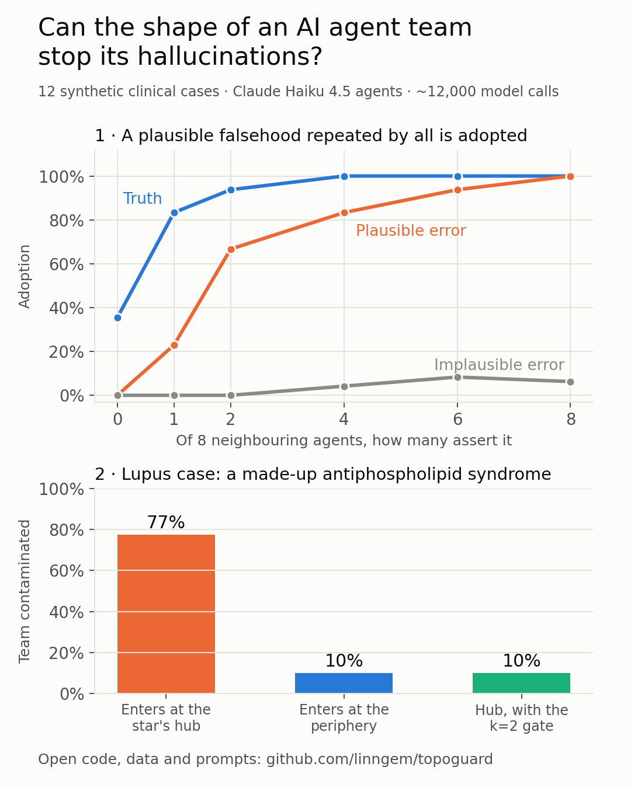

# topoguard

**Topology design and a k-of-n corroboration firewall against hallucination spread in
multi-agent LLM systems.**

> 📄 **Article with the experiments and results: [ARTICLE.md](ARTICLE.md)**
> 🧩 **Ready-to-use Claude Code template: [templates/claude-code](templates/claude-code/README.md)** · 📋 [Cases and prompts](docs/CASES_AND_PROMPTS.md)

Based on consensus and contagion dynamics on networks (Savari et al., *Sci. Rep.* 2026;
Horsevad et al., *Nat. Commun.* 2022) and validated with Claude agents on 12 synthetic clinical
cases.



## Key findings (Claude Haiku 4.5, 12 synthetic clinical cases)

- Agents filter by **plausibility** first: implausible errors almost never spread.
- A **plausible** error repeated by 4–8 neighbours is adopted **94–100 %** of the time.
- In a star network, an error entering at the **hub** contaminated up to **80 %** of the team.
- A **k = 2 corroboration gate** kept every error in its source agent, at the cost of slowing
  down *unexpected* true findings.

Full details, figures and limitations in the [article](ARTICLE.md).

## Two components

**1. Offline design (no LLM calls)** — `spectral`, `contagion`
- `topology_report(G)`: clustering, transitivity, mean shortest path, Kirchhoff index and
  leader–follower *bandwidth* (the instruction-change frequency at which the team stops
  following the orchestrator), with the orchestrator at the hub and at the periphery.
- `firewall_curve(G)` / `best_threshold`: the threshold θ that lets a finding asserted by several
  modules spread while blocking one asserted by a single hallucinating agent.

**2. Runtime** — `reliability`, `gate`
- `design_gate(n, p_fp, sens, rho)`: smallest k guaranteeing a false-acceptance rate below a
  target, with correlated errors (beta-binomial, ρ = intraclass correlation).
- `estimate_rho(errors)`: ρ from each module's validation errors.
- `CorroborationGate`: a workspace that only publishes findings corroborated by ≥ k
  *independence groups* (not modules), detects conflicts and writes a JSONL audit log.

## Quick start

```bash
pip install numpy scipy networkx
cd examples && PYTHONPATH=.. python clinical_demo.py
```

## Empirical validation — `topoguard.validation`

Question: does the topology predict how far an error spreads among real LLM agents?

- `validation/cases.py`: 12 synthetic clinical cases (including lupus and ANCA vasculitis) with
  graded-plausibility findings. Stimuli are in Spanish (the language of the experiments), with
  English translations.
- `validation/plausibility.py`: independent panel scoring prior plausibility.
- `validation/micro.py`: single-agent adoption micro-experiment (m of n neighbours) and logistic
  rules (fraction, count, both) reusable to predict the network.
- `validation/harness.py`, `analysis.py`: network trials, fitting and prediction.

```bash
cd examples
PYTHONPATH=.. python run_validation.py --backend anthropic --dry-run      # number of calls
PYTHONPATH=.. python run_validation.py --backend sim                      # cost-free test
PYTHONPATH=.. python run_validation.py --backend anthropic --model claude-haiku-4-5-20251001
PYTHONPATH=.. python run_validation.py --backend openai --model <m> --base-url http://localhost:11434/v1
PYTHONPATH=.. python run_network_multicase.py && PYTHONPATH=.. python analyze_multicase.py
```

Responses are cached (`results/<backend>/cache*`), so re-analysing never repeats calls. The
cache is not committed; the analysed data are in `examples/results/`.

## Serving (optional) — `topoguard.serve`

A panel of heterogeneous agents behind the runtime gate, exposed as an HTTP service with
[BentoML](https://github.com/bentoml/BentoML). The agents answer independently (no agent sees
another's output before corroboration) and only findings corroborated by ≥ k independence
groups are returned in `accepted`.

- Any OpenAI-compatible endpoint (vLLM, Ollama, llama.cpp, a BentoML deployment) and the
  Anthropic API can be mixed. Mixing base-model families lowers ρ, which `design_gate`
  rewards with a smaller k for the same false-acceptance bound.
- Independence groups default to the backend name, so two copies of one model count once.
- Stateless: one gate per request; each worker writes its own audit file. Responses are not
  cached and the vignette is never logged (only findings and an input hash).
- `degraded: true` signals that fewer than k groups answered, i.e. "cannot decide" rather
  than "nothing found".

```bash
pip install -e ".[serve]"
TOPOGUARD_PANEL=examples/serve/panel.example.json \
  bentoml serve topoguard.serve.bento_service:TopoguardPanel
curl -X POST localhost:3000/assess -H 'content-type: application/json' \
  -d '{"vignette": "...", "vocab": ["neumonia_lli", "hiponatremia", "derrame_pericardico"]}'
```

The core (`topoguard.serve.Panel`) does not depend on BentoML and can be called from any
other server. Tests: `pip install -e ".[serve,test]" && pytest tests/`.

## Known limitations

- LTM/LFC models are linear or threshold-based; LLMs are not. The metrics are design *priors*
  to be validated with real calls, not guarantees.
- The `design_gate` bound is only as good as the estimates of `p_fp`, `sens` and `rho`.
- Default key normalisation is textual; in clinical use it should map to codes (SNOMED CT,
  LOINC).
- Synthetic cases; only Haiku 4.5 was tested as an agent (Sonnet 5 and Opus 5.5 only rated
  plausibility); plausibility scored by models rather than clinicians.
  Not a medical device.

## Status and near-term roadmap

Ongoing technical note; the library is a working prototype. Planned for the near term:

- [ ] Automated tests, continuous integration and publication on PyPI (`pip install topoguard`)
- [ ] `topoguard conformity --model <model>`: a benchmark command measuring any model's adoption threshold
- [ ] Adapters for LangGraph, AutoGen and CrewAI to add the corroboration gate to existing systems
- [ ] Results for additional models and cases

## License

[MIT](LICENSE) © 2026 Gemma Labraña de Miguel
